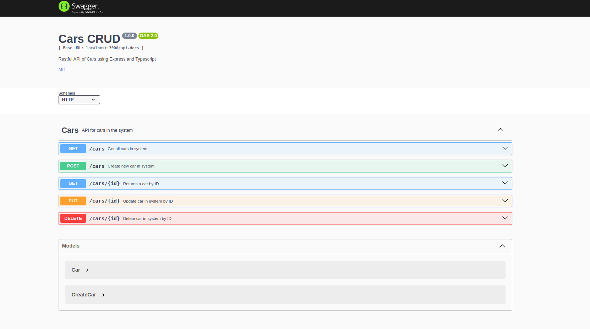

# Cars API

Restful API of Cars using Express and Typescript.

## Installation

```bash
npm install
```

## Usage

To run the API:

```bash
npm run dev
```
You can see endpoints, parameters and responses through swagger, using **http://localhost:3000/api-docs/swagger.json**



Create a database where the data will be stored. In the **.env** file, add your PostgreSQL credentials.

## Technologies

- Node.js
- Typescript
- Express
